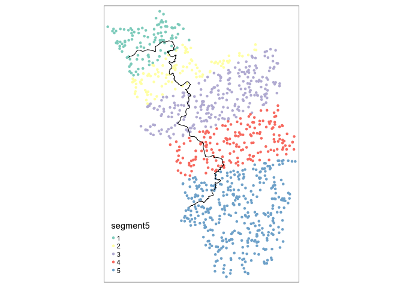
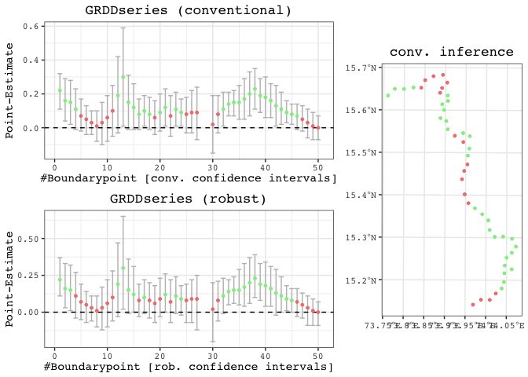

<!-- README.md is generated from README.Rmd. Please edit the latter file - rmarkdown::render('README.Rmd', output_format = 'github_document', output_file = 'README.md') -->

# Spatial[R]()DD

This repository hosts the code underlying the R package `SpatialRDD`.
The workhorse functions in a nutshell are:

  - `assign_treated()`
  - `border_segment()`
  - `discretise_border()`
  - `spatialrd()`
  - `plotspatialrd()`
  - `printspatialrd()`
  - `shift_border()`
  - `cutoff2polygon()`

The package can estimate heterogenous treatment effects alongside an RD
cutoff. Moreover it provides powerful spatial functions to carry out
placebo exercises (move borders and reassign (placebo) treatment
status). These functionalities are also useful for different empirical
identification strategies that rely on flexibly changing geographic
boundaries.

For full guidance check out the different vignettes in the vignettes
folder here on github or with

  - `vignette(spatialrdd_vignette)`
  - `vignette(shifting_borders)`

in the R console.

## Installation

``` r
install.packages("devtools")
devtools::install_github("axlehner/SpatialRDD")
```

## Quick Guide

Adding border segment for transparent fixed effect category creation:

``` r
points_samp.sf$segment5 <- border_segment(points_samp.sf, cut_off.sf, 5)
#> Starting to create 5 border segments with an approximate length of 26 kilometres each.
tm_shape(points_samp.sf) + tm_dots("segment5", size = 0.1) + tm_shape(cut_off.sf) + tm_lines()
```

<!-- -->

Create points alongside border and run GRD

``` r
borderpoints.sf <- discretise_border(cutoff = cut_off.sf, n = 50)
#> Starting to create 50 borderpoints from the given set of borderpoints. Approximately every 3 kilometres we can run an estimation then.
results <- spatialrd(y = "education", data = points_samp.sf, cutoff.points = borderpoints.sf, treated = "treated", minobs = 10)
#> We have 1000 observations of which 215 are treated observations.
#> We are iterating over 50 Boundarypoints.
#> The dependent variable is education .
plotspatialrd(results, map = T)
```

<!-- -->

## References
