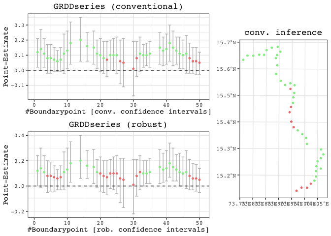

<!-- README.md is generated from README.Rmd. Please edit the latter file - rmarkdown::render('README.Rmd', output_format = 'github_document', output_file = 'README.md') -->

# Spatial[R]()DD

This repository hosts the code underlying the R package `SpatialRDD`.
The workhorse functions in a nutshell are:

  - `assign_treated()`
  - `border_segment()`
  - `discretise_border()`
  - `spatialrd()`
  - `plotspatialrd()`
  - `printspatialrd()`
  - `shift_border()`
  - `cutoff2polygon()`

The package can estimate heterogenous treatment effects alongside an RD
cutoff. Moreover it provides powerful spatial functions to carry out
placebo exercises (move borders and reassign (placebo) treatment
status). These functionalities are also useful for different empirical
identification strategies that rely on flexibly changing geographic
boundaries.

For full guidance check out the different vignettes in the vignettes
folder here on github or with

  - `vignette(spatialrdd_vignette)`
  - `vignette(shifting_borders)`

in the R console.

## Installation

``` r
install.packages("devtools")
devtools::install_github("axlehner/SpatialRDD")
```

What you need to run you own spatial RD with `SpatialRDD`: 1. An RD
boundary as a single line (the simplest way is to cut this by hand in
e.g. ArcGIS or QGIS by just splitting the features - also make sure to
merge all features together in case there are multiple left, this will
be important and prevent annoying troubles in the RD process) 2. The
data frame containing the columns with x- and y-coordinates. Read in
with `read.csv()` or with `readstata13::read.dta13()`. Make them an sf
object with `st_as_sf(data, coords = c("x", "y"), crs = 4326)` if you
have longitude/latitude as coordinates. If this is the case use
`st_transform()` on all your objects into a local UTM projection (not
necessary but recommended for several reasons) 3. Ideally also a polygon
that covers the treated areas (this could be created within the package
with `cutoff2polygon` though)

You could verify the “geographic validity” of your objects with
e.g. `mapview::mapview()`.

## Quick Guide

    #> Warning: attribute variables are assumed to be spatially constant throughout all geometries
    #> Warning in rnorm(NTr, mean = 0, sd = 0.1) + points_samp.sf$education[points_samp.sf$treated == : longer object length
    #> is not a multiple of shorter object length
    #> Warning in rnorm(NCo, mean = 0, sd = 0.1) + points_samp.sf$education[points_samp.sf$treated == : longer object length
    #> is not a multiple of shorter object length
    #> Warning in points_samp.sf$education[points_samp.sf$treated == 0] <- rnorm(NCo, : number of items to replace is not a
    #> multiple of replacement length

Adding border segment for transparent fixed effect category creation
(for the non-parametric specification that is just OLS with `lm()` or
`lfe::felm()`):

``` r
points_samp.sf$segment5 <- border_segment(points_samp.sf, cut_off.sf, 5)
#> Starting to create 5 border segments with an approximate length of 26 kilometres each.
tm_shape(points_samp.sf) + tm_dots("segment5", size = 0.1) + tm_shape(cut_off.sf) + tm_lines()
```

<!-- -->

Create points alongside border and run GRD to explore heterogeneity:

``` r
borderpoints.sf <- discretise_border(cutoff = cut_off.sf, n = 50)
#> Starting to create 50 borderpoints from the given set of borderpoints. Approximately every 3 kilometres we can run an estimation then.
results <- spatialrd(y = "education", data = points_samp.sf, cutoff.points = borderpoints.sf, treated = "treated", minobs = 10)
#> We have 1000 observations of which 215 are treated observations.
#> We are iterating over 50 Boundarypoints.
#> The dependent variable is education .
#> Warning in log(fhatr): NaNs produced
#> Warning in sqrt((1/(rn * bw)) * (24/5) * ((1/fhatr) + (1/fhatl))): NaNs produced
#> Warning in log(fhatr): NaNs produced
#> Warning in sqrt((1/(rn * bw)) * (24/5) * ((1/fhatr) + (1/fhatl))): NaNs produced
#> Warning in log(fhatr): NaNs produced
#> Warning in sqrt((1/(rn * bw)) * (24/5) * ((1/fhatr) + (1/fhatl))): NaNs produced
#> Warning in log(fhatr): NaNs produced
#> Warning in sqrt((1/(rn * bw)) * (24/5) * ((1/fhatr) + (1/fhatl))): NaNs produced
#> Warning in log(fhatr): NaNs produced
#> Warning in sqrt((1/(rn * bw)) * (24/5) * ((1/fhatr) + (1/fhatl))): NaNs produced
#> Warning in log(fhatr): NaNs produced

#> Warning in log(fhatr): NaNs produced
#> Warning in log(fhatl): NaNs produced
#> Warning in sqrt((1/(rn * bw)) * (24/5) * ((1/fhatr) + (1/fhatl))): NaNs produced
#> Warning in log(fhatr): NaNs produced
#> Warning in log(fhatl): NaNs produced
#> Warning in sqrt((1/(rn * bw)) * (24/5) * ((1/fhatr) + (1/fhatl))): NaNs produced
#> Warning in log(fhatr): NaNs produced
#> Warning in log(fhatl): NaNs produced
#> Warning in sqrt((1/(rn * bw)) * (24/5) * ((1/fhatr) + (1/fhatl))): NaNs produced
#> Warning in log(fhatr): NaNs produced
#> Warning in log(fhatl): NaNs produced
#> Warning in sqrt((1/(rn * bw)) * (24/5) * ((1/fhatr) + (1/fhatl))): NaNs produced
#> Warning in log(fhatr): NaNs produced
#> Warning in log(fhatl): NaNs produced
#> Warning in sqrt((1/(rn * bw)) * (24/5) * ((1/fhatr) + (1/fhatl))): NaNs produced
#> Warning in log(fhatr): NaNs produced
#> Warning in log(fhatl): NaNs produced
#> Warning in sqrt((1/(rn * bw)) * (24/5) * ((1/fhatr) + (1/fhatl))): NaNs produced
#> Warning in log(fhatl): NaNs produced

#> Warning in log(fhatl): NaNs produced

#> Warning in log(fhatl): NaNs produced

#> Warning in log(fhatl): NaNs produced

#> Warning in log(fhatl): NaNs produced
#> Warning in log(fhatr): NaNs produced
#> Warning in log(fhatl): NaNs produced
#> Warning in sqrt((1/(rn * bw)) * (24/5) * ((1/fhatr) + (1/fhatl))): NaNs produced
#> Warning in log(fhatr): NaNs produced
#> Warning in log(fhatl): NaNs produced
#> Warning in sqrt((1/(rn * bw)) * (24/5) * ((1/fhatr) + (1/fhatl))): NaNs produced
#> Warning in log(fhatr): NaNs produced
#> Warning in log(fhatl): NaNs produced
#> Warning in sqrt((1/(rn * bw)) * (24/5) * ((1/fhatr) + (1/fhatl))): NaNs produced
#> Warning in log(fhatr): NaNs produced
#> Warning in log(fhatl): NaNs produced
#> Warning in sqrt((1/(rn * bw)) * (24/5) * ((1/fhatr) + (1/fhatl))): NaNs produced
#> Warning in log(fhatl): NaNs produced
#> Warning in log(fhatr): NaNs produced
#> Warning in sqrt((1/(rn * bw)) * (24/5) * ((1/fhatr) + (1/fhatl))): NaNs produced
#> Warning in log(fhatl): NaNs produced
#> Warning in log(fhatr): NaNs produced
#> Warning in log(fhatl): NaNs produced
#> Warning in sqrt((1/(rn * bw)) * (24/5) * ((1/fhatr) + (1/fhatl))): NaNs produced
#> Warning in log(fhatr): NaNs produced
#> Warning in log(fhatl): NaNs produced
#> Warning in sqrt((1/(rn * bw)) * (24/5) * ((1/fhatr) + (1/fhatl))): NaNs produced
#> Warning in log(fhatr): NaNs produced
#> Warning in sqrt((1/(rn * bw)) * (24/5) * ((1/fhatr) + (1/fhatl))): NaNs produced
#> Warning in log(fhatl): NaNs produced
#> Warning in sqrt((1/(rn * bw)) * (24/5) * ((1/fhatr) + (1/fhatl))): NaNs produced
#> Warning in log(fhatl): NaNs produced

#> Warning in log(fhatl): NaNs produced
#> Warning in sqrt((1/(rn * bw)) * (24/5) * ((1/fhatr) + (1/fhatl))): NaNs produced
#> Warning in log(fhatr): NaNs produced
#> Warning in sqrt((1/(rn * bw)) * (24/5) * ((1/fhatr) + (1/fhatl))): NaNs produced
#> Warning in log(fhatl): NaNs produced
#> Warning in sqrt((1/(rn * bw)) * (24/5) * ((1/fhatr) + (1/fhatl))): NaNs produced
#> Warning in log(fhatl): NaNs produced
#> Warning in sqrt((1/(rn * bw)) * (24/5) * ((1/fhatr) + (1/fhatl))): NaNs produced
#> Warning in log(fhatl): NaNs produced
#> Warning in sqrt((1/(rn * bw)) * (24/5) * ((1/fhatr) + (1/fhatl))): NaNs produced
#> Warning in log(fhatl): NaNs produced
#> Warning in sqrt((1/(rn * bw)) * (24/5) * ((1/fhatr) + (1/fhatl))): NaNs produced
plotspatialrd(results, map = T)
```

<!-- -->

## References
