Within the last years, the use of spatial version of Regression Discontinuity Designs has increased tremendously in popularity in the social sciences, most importantly Economics and Political Science.
`SpatialRDD` is the first (geo-)statistical package of its kind that unifies the geographic tasks that are needed for Spatial Regression Discontinuity Designs with all potential parametric and non-parametric estimation techniques that have been put forward (see Lehner2019). Geographic objects are treated as [simple features](https://en.wikipedia.org/wiki/Simple_Features) throughout, making heavy use of the novel `sf` package by Edzer Pebesma which revolutionised spatial data analysis in **R** and is bound to supersede the older and less versatile `sp` package.  
`SpatialRDD` facilitates analysis inter alia because it contains all necessary functions to automatise otherwise very tedious tasks that are tipically carried out in GUIs such as QGIS or ArcGIS. Due to the fact that these GIS interfaces are not able to carry out appropriate statistical analysis, the researcher is tipically forced to migrate the obtained results to statistical software. This makes reproducibility difficult and most importantly is a very inefficient workflow.  
`SpatialRDD` unifies everything in one language and e.g. has the necessary functions to check for different bandwiths, shift placebo boundaries, do all necessary distance calculations, assign treated/non-treated dummies, and flexibly assign border segment fixed effects while keeping the units of observations at their proper position in space and allowing the researcher to visualise every intermediate step with mapplots. For the latter we will mostly rely on the flexible and computationally very efficient `tmap` package, while also `ggplot2` is used at times.  
For the purpose of illustration, this vignette uses simulated data on real boundaries/polygons and guides the user through every necessary step in order to carry out a Geographic RDD estimation. At the appropriate points we will also make remarks on technical caveats and issues that have been pointed out in the literature and give suggestions to improve these designs.   
The workhorse functions of `SpatialRDD` in a nutshell are:

* `assign_treated()`
* `border_segment()`
* `discretise_border()`
* `SpatialRD()`
* `plotspatialrd()`
* `placebo_border()`
* `cutoff2polygons()`

# Some words of caution

all the projections system importance plus the story mit GADM is dangerous (visualise with leaflet odersowas auf openstreetmap)

# Setup and Propaedeutics

Throughout the vignette we will use the geographic boundaries on Goa, India, from Lehner (2019). The data, included in the package, contains

* a line called `cut_off.sf` which resembles the spatial discontinuity
* a polygon that defines the "treated" area
* a polygon that defines the full study area (which is going to be useful as this defines the bounding box)


```r
library(SpatialRDD)
library(sf)
data(Goa_GIS)
```

These come in the EPSG 32643 projection system, which is a "localised" [UTM](https://en.wikipedia.org/wiki/Universal_Transverse_Mercator_coordinate_system) coordinate system. These are generally prefereable for exercises like a Spatial RDD, as they are more precise and also allow us to work in metres (the "classic" longitude/latitude CRS, EPSG 4326, works in degrees). If your study area is small, you should think about reprojecting your data into the CRS of the according UTM zone (simply use `st_transform()`).

All the spatial objects are of class `sf` from the [sf package](https://CRAN.R-project.org/package=sf). This means they are just a `data.frame` with a special column that contains a geometry for each row. The big advantage is, no matter if you prefer base R, `dplyr`, or any other way to handle and wrangle your data, the `sf` object can be treated just like a standard `data.frame`. The one single step that transforms these spatial objects back to a standard `data.frame` is just dropping the geometry column with

```r
st_geometry(any.sf.object) <- NULL
```
or alternatively

```r
st_set_geometry(any.sf.object, NULL)
```

If you import geospatial data in a different format, say the common shapefile (`*.shp`) - which is NOT preferrable [see why here](http://switchfromshapefile.org/), or as a geopackage, it is fairly straightforward to convert it:


```r
mydata.sf <- st_as_sf(loaded_file, coords = c("longitude", "latitude"), crs = projcrs) 
# just the EPSG or a proj4string
```


## Inspecting the Study Area & simulating Data

```r
library(tmap)
tm_shape(polygon_full.sf) + tm_polygons() + 
  tm_shape(polygon_treated.sf) + tm_polygons(col = "grey") + 
  tm_shape(cut_off.sf) + tm_lines(col = "red")
```

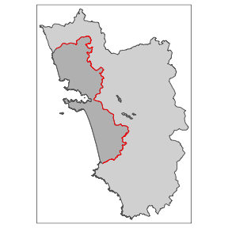<!-- -->

Above we see the simple map, visualising the "treated polygon" in a darker grey, and the `tmap` syntax that produced it.

Let's simulate some random points within the polygon that describes the full study area:

```r
set.seed(1088) # set a seed to make the results replicable
points_samp.sf <- sf::st_sample(polygon_full.sf, 1000)
points_samp.sf <- sf::st_sf(points_samp.sf) # make it an sf object bc st_sample just created the geometry list-column (sfc)
points_samp.sf$id <- 1:nrow(points_samp.sf) # add a unique ID to each observation
# visualise results together with the line that represents our RDD cut-off
tm_shape(points_samp.sf) + tm_dots() + tm_shape(cut_off.sf) + tm_lines(col = "red")
```

<!-- -->

## Assign Treatment

Now we use the first function of the `SpatialRDD` package which is called `assign_treated()` which in essence does a spatial intersection and returns a column vector that contains `0` or `1` depending on whether the village is inside or outside the treatment area. Thus we just add it as a new column to the points object. The function requires the name of the points object, the name of the polygon that defines the treated area, and the id that uniquely identifies each observation in the points object:


```r
points_samp.sf$treated <- assign_treated(points_samp.sf, polygon_treated.sf, id = "id")
tm_shape(points_samp.sf) + tm_dots("treated", palette = "Set1") + tm_shape(cut_off.sf) + tm_lines(col = "red")
```

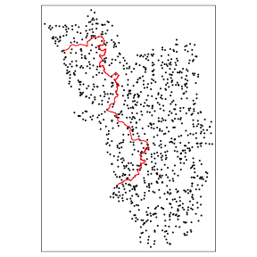<!-- -->

As a next step we add an outcome of interest that we are going to use as dependent variable in our Spatial Regression Discontinuity Design. Let's call this variable `education`, measuring the literacy rate that ranges from 0 to 1 (0%, meaning everyone illiterate to 100%, meaning everyone in the population can read and write). We assume that the units, call them villages, in the "treated" polygon have on average a higher literacy rate because they received some sort of "treatment". Let's just assume aliens dropped (better) schools in all of these villages, but NOT in any of the outside villages, and everything else is constant and identical across the two territories. 


```r
# first we define a variable for the number of "treated" and control which makes the code more readable in the future
NTr <- length(points_samp.sf$id[points_samp.sf$treated == 1])
NCo <- length(points_samp.sf$id[points_samp.sf$treated == 0])
# the treated areas get a 10 percentage point higher literacy rate
points_samp.sf$education[points_samp.sf$treated == 1] <- 0.7
points_samp.sf$education[points_samp.sf$treated == 0] <- 0.6
# and we add some noise, otherwise we would obtain regression coeffictions with no standard errors
# we draw from a normal with mean 0 and a standard devation of 0.1
points_samp.sf$education[points_samp.sf$treated == 1] <- rnorm(NTr, mean = 0, sd = .1) +
  points_samp.sf$education[points_samp.sf$treated == 1]
points_samp.sf$education[points_samp.sf$treated == 0] <- rnorm(NCo, mean = 0, sd = .1) +
  points_samp.sf$education[points_samp.sf$treated == 0]
# visualisation split up by groups
library(ggplot2)
ggplot(points_samp.sf, aes(x = education)) + geom_histogram(binwidth = .01) + facet_grid(treated ~ .)
```

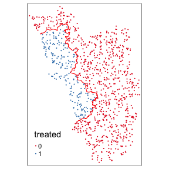<!-- -->

From the above histograms we can see that we were successful in creating different group means. This is also confirmed by the simple univariate regression of $Y_i = \alpha + \beta T_i + \varepsilon_i$:

```r
summary(lm(education ~ treated, data = points_samp.sf))
#> 
#> Call:
#> lm(formula = education ~ treated, data = points_samp.sf)
#> 
#> Residuals:
#>      Min       1Q   Median       3Q      Max 
#> -0.36008 -0.06679  0.00274  0.07155  0.30580 
#> 
#> Coefficients:
#>             Estimate Std. Error t value Pr(>|t|)    
#> (Intercept) 0.600549   0.003559  168.75   <2e-16 ***
#> treated1    0.104671   0.007675   13.64   <2e-16 ***
#> ---
#> Signif. codes:  0 '***' 0.001 '**' 0.01 '*' 0.05 '.' 0.1 ' ' 1
#> 
#> Residual standard error: 0.09971 on 998 degrees of freedom
#> Multiple R-squared:  0.1571,	Adjusted R-squared:  0.1562 
#> F-statistic:   186 on 1 and 998 DF,  p-value: < 2.2e-16
```
where the intercept tells us that the average in the non-treated areas is 0.6 and treated villages have on average 0.1 more education (10 percentage points).

### Distance to Cut-off

The next essential step before we start to do proper Spatial RDD analysis, is to determine how far each of these points is away from the cut-off. Here we just make use of a function from `sf` called `st_distance()` that returns a vector with units (that we have to convert to real numbers by `as.numeric()`):


```r
points_samp.sf$dist2cutoff <- as.numeric(sf::st_distance(points_samp.sf, cut_off.sf))
```

This allows us now to investigate villages only within a certain range, say 3 kilometres, around our "discontinuity":

```r
tm_shape(points_samp.sf[points_samp.sf$dist2cutoff < 3000, ]) + tm_dots("education", palette = "RdYlGn", size = .1) + 
  tm_shape(cut_off.sf) + tm_lines()
```

<!-- -->

And to run the univariate regression from above also just within a bandwith (this specification is already starting to resemble the RDD idea of Dell 2010). As we know the exact data generating process (no "spatial gradiant" but a rather uniform assignment), it is obvious to us that this of course leaves the point estimate essentially unchanged:


```r
summary(lm(education ~ treated, data = points_samp.sf[points_samp.sf$dist2cutoff < 3000, ]))
#> 
#> Call:
#> lm(formula = education ~ treated, data = points_samp.sf[points_samp.sf$dist2cutoff < 
#>     3000, ])
#> 
#> Residuals:
#>       Min        1Q    Median        3Q       Max 
#> -0.257934 -0.061686 -0.000072  0.065436  0.225890 
#> 
#> Coefficients:
#>             Estimate Std. Error t value Pr(>|t|)    
#> (Intercept)  0.61207    0.01053  58.101  < 2e-16 ***
#> treated1     0.09000    0.01504   5.984 1.42e-08 ***
#> ---
#> Signif. codes:  0 '***' 0.001 '**' 0.01 '*' 0.05 '.' 0.1 ' ' 1
#> 
#> Residual standard error: 0.09481 on 157 degrees of freedom
#> Multiple R-squared:  0.1857,	Adjusted R-squared:  0.1805 
#> F-statistic: 35.81 on 1 and 157 DF,  p-value: 1.423e-08
```


# Nonparametric estimation

Now we go step by step through all potential (parametric and non-parametric) ways in which one could obtain point estimates for Spatial RDD's (see e.g. Lehner2019 for details).


## Naive Distance

For the "naive" estimation (KeeleTitiunik2015), meaning that the spatial dimension is essentially disregarded, we first define a variable `distrunning` that makes the distances in the treated areas negative so that our 2-dimensional cut-off is then at 0.


```r
points_samp.sf$distrunning <- points_samp.sf$dist2cutoff
points_samp.sf$distrunning[points_samp.sf$treated == 1] <- -1 * points_samp.sf$distrunning[points_samp.sf$treated == 1]
ggplot(data = points_samp.sf, aes(x = distrunning, y = education)) + geom_point() + geom_vline(xintercept = 0, col = "red")
```

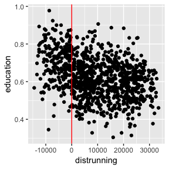<!-- -->

The point estimate of the "classic" non-parametric local linear regression, carried out with the `rdrobust` package, then looks like this:


```r
library(rdrobust)
summary(rdrobust(points_samp.sf$education, points_samp.sf$distrunning, c = 0))
#> Call: rdrobust
#> 
#> Number of Obs.                 1000
#> BW type                       mserd
#> Kernel                   Triangular
#> VCE method                       NN
#> 
#> Number of Obs.                 215         785
#> Eff. Number of Obs.            100         127
#> Order est. (p)                   1           1
#> Order bias  (p)                  2           2
#> BW est. (h)               4248.546    4248.546
#> BW bias (b)               6601.220    6601.220
#> rho (h/b)                    0.644       0.644
#> 
#> =============================================================================
#>         Method     Coef. Std. Err.         z     P>|z|      [ 95% C.I. ]       
#> =============================================================================
#>   Conventional    -0.116     0.025    -4.580     0.000    [-0.166 , -0.066]    
#>         Robust         -         -    -4.089     0.000    [-0.181 , -0.064]    
#> =============================================================================
```
and the according visualisation with data driven bin-width selection:

```r
rdplot(points_samp.sf$education, points_samp.sf$distrunning, c = 0, ci = 95, 
       kernel = "triangular", y.label = "education", x.label = "distance to border")
```

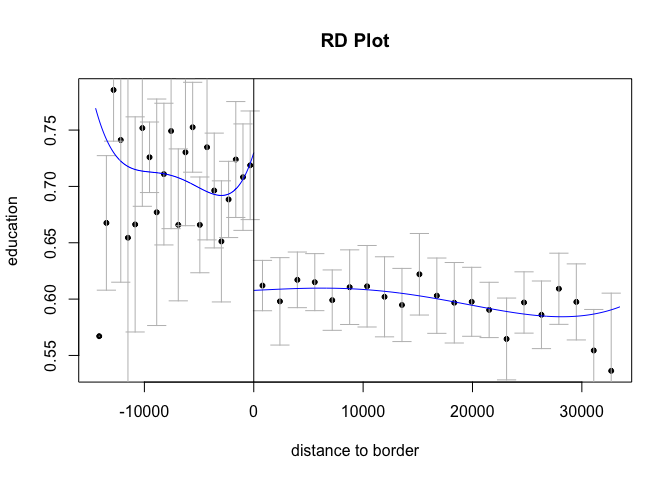

For RDD estimation in **R** in general there are currently three packages flying around: `RDD`, `rddtools`, and `rddapp` (building on the `RDD`); whereby the latter seems to be the most up-to-date and comprehensive one (as it draws on previous work that others did).  
`rddapp` estimates various specifications (does not do robust inference though)


```r
library(rddapp)
summary(rd_est(education ~ distrunning, data = points_samp.sf, t.design = "g"))
#> 
#> Call:
#> rd_est(formula = education ~ distrunning, data = points_samp.sf, 
#>     t.design = "g")
#> 
#> Type:
#> sharp 
#> 
#> Estimates:
#>             Bandwidth  Observations  Estimate  Std. Error  lower.CL
#> Linear         NA      1000          -0.08474  0.01321     -0.1106 
#> Quadratic      NA      1000          -0.09778  0.01888     -0.1348 
#> Cubic          NA      1000          -0.11587  0.02409     -0.1631 
#> Opt         15055       652          -0.09259  0.01540     -0.1228 
#> Half-Opt     7527       415          -0.10276  0.01957     -0.1411 
#> Double-Opt  30110       975          -0.08809  0.01351     -0.1146 
#>             upper.CL  z value  Pr(>|z|)      
#> Linear      -0.05884  -6.413   1.425e-10  ***
#> Quadratic   -0.06078  -5.179   2.226e-07  ***
#> Cubic       -0.06864  -4.809   1.517e-06  ***
#> Opt         -0.06240  -6.011   1.848e-09  ***
#> Half-Opt    -0.06440  -5.250   1.519e-07  ***
#> Double-Opt  -0.06161  -6.519   7.082e-11  ***
#> ---
#> Signif. codes:  0 '***' 0.001 '**' 0.01 '*' 0.05 '.' 0.1 ' ' 1
#> 
#> Confidence interval used:  0.95
```

And it gives several possibilities of visualising classic RDDs. Here we arbitrarily pick one parametric and one non-parametric estimate, including confidence intervals, and manually chosen binsizes:


```r
plot(rd_est(education ~ distrunning, data = points_samp.sf, t.design = "g"), fit_line = c("quadratic", "optimal"), bin_n = 50)
```

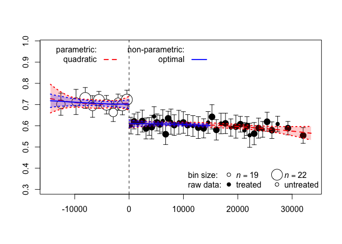

## Parametric Specifications

This method, popularised by Dell2010 in her JMP on the Peruvian Mining Mita, examines only observations within a certain distance around the border by using a (semi-)parametric approach. From the point of view of which additional "spatial technicalities" are needed, it essentially only boils down to the introduction of border segments. These are then used to apply a "within estimator" to allow for different intercepts for each of those segment categories in order to, inter alia, alleviate the omitted variable problem. As an alternative to this fixed-effects approach we might as well throw a set of dummies for each of the segments in the regression. The regression coefficient of interest then gives a weighted average over all segments. On top of that we might also be interested in the coefficient of each segment to infer something about potential heterogeneity alongside our regression discontinuity.   
The (computationally a bit demanding) function `border_segment()` only needs the points layer and the cut-off as input (preferrably as line, but also an input in the form of boundarypoint works). The last parameter of the function let's us determine how many segments we want. As with the `assign_treated()` function, the output is a vector of factors.


```r
points_samp.sf$segment10 <- border_segment(points_samp.sf, cut_off.sf, 10)
#> Starting to create 10 border segments with an approximate length of 13 kilometres each.
points_samp.sf$segment15 <- border_segment(points_samp.sf, cut_off.sf, 15)
#> Starting to create 15 border segments with an approximate length of 9 kilometres each.
tm_shape(points_samp.sf) + tm_dots("segment10", size = 0.1) + tm_shape(cut_off.sf) + tm_lines()
tm_shape(points_samp.sf) + tm_dots("segment15", size = 0.1) + tm_shape(cut_off.sf) + tm_lines()
```

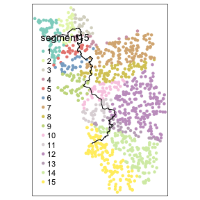

It is worth noting that the researcher has to pay attention to how the fixed effects are assigned. It could, e.g. due to odd bendings of the cut-off, be the case that for some segment only one side actually gets assigned points or the like. These situations are undesireable for estimation and a visualisation of how the segments are distributed across space is paramount.   
The `border_segment()` already gives the researcher a feeling for how meaningful the choice for the number of segments was. In the above example we have a segment for every 13 kilometres, which seems not too unreasonable.   
In the following example we choose less borderpoints, leading to more observations on each side of the border for every segment and thus to more meaningful point estimates:


```r
points_samp.sf$segment5 <- border_segment(points_samp.sf, cut_off.sf, 5)
#> Starting to create 5 border segments with an approximate length of 26 kilometres each.
tm_shape(points_samp.sf) + tm_dots("segment5", size = 0.1) + tm_shape(cut_off.sf) + tm_lines()
```

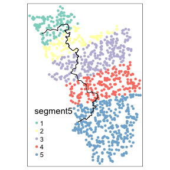<!-- -->

Simple OLS estimates, using the segments that we just obtained as categories for our fixed effects, show these differences (which in our simulated case of course are negligible):


```r
library(lfe)
#> Loading required package: Matrix
summary(felm(education ~ treated | factor(segment10) | 0 | 0, data = points_samp.sf[points_samp.sf$dist2cutoff < 3000, ]), robust = T)
#> 
#> Call:
#>    felm(formula = education ~ treated | factor(segment10) | 0 |      0, data = points_samp.sf[points_samp.sf$dist2cutoff < 3000,      ]) 
#> 
#> Residuals:
#>       Min        1Q    Median        3Q       Max 
#> -0.246057 -0.056366 -0.000329  0.057795  0.250126 
#> 
#> Coefficients:
#>          Estimate Robust s.e t value Pr(>|t|)    
#> treated1  0.09034    0.01533   5.892 2.47e-08 ***
#> ---
#> Signif. codes:  0 '***' 0.001 '**' 0.01 '*' 0.05 '.' 0.1 ' ' 1
#> 
#> Residual standard error: 0.09513 on 148 degrees of freedom
#> Multiple R-squared(full model): 0.2273   Adjusted R-squared: 0.1751 
#> Multiple R-squared(proj model): 0.1787   Adjusted R-squared: 0.1233 
#> F-statistic(full model, *iid*):4.353 on 10 and 148 DF, p-value: 2.379e-05 
#> F-statistic(proj model): 34.72 on 1 and 148 DF, p-value: 2.467e-08

summary(felm(education ~ treated | factor(segment5) | 0 | 0, data = points_samp.sf[points_samp.sf$dist2cutoff < 3000, ]), robust = T)
#> 
#> Call:
#>    felm(formula = education ~ treated | factor(segment5) | 0 | 0,      data = points_samp.sf[points_samp.sf$dist2cutoff < 3000,          ]) 
#> 
#> Residuals:
#>       Min        1Q    Median        3Q       Max 
#> -0.256377 -0.054222 -0.000243  0.056040  0.259639 
#> 
#> Coefficients:
#>          Estimate Robust s.e t value Pr(>|t|)    
#> treated1  0.08861    0.01467   6.041 1.12e-08 ***
#> ---
#> Signif. codes:  0 '***' 0.001 '**' 0.01 '*' 0.05 '.' 0.1 ' ' 1
#> 
#> Residual standard error: 0.09228 on 153 degrees of freedom
#> Multiple R-squared(full model): 0.2483   Adjusted R-squared: 0.2237 
#> Multiple R-squared(proj model): 0.189   Adjusted R-squared: 0.1625 
#> F-statistic(full model, *iid*):10.11 on 5 and 153 DF, p-value: 2.229e-08 
#> F-statistic(proj model): 36.49 on 1 and 153 DF, p-value: 1.121e-08
```

We obtain a point estimate that is (unsurprisingly, as we have a data generating process that is very uniform across space) very similar to the one we obtained from the simple OLS regression from the beginning. As compared to the "classic RD" point estimate that we obtained from the non-parametric local linear regression from the `rdrobust` package, the point estimate from our fixed effects regression is a bit more conservative. But from eyeballing we can determine that the average effect lies somewhere around 0.1, meaning that the literacy rate is 10 percentage points higher in the treated areas. Exactly the way we designed our simulated data.   
In the "full" polynomial specification by Dell2010 we would be required to also control for the position in space via a flexible polynomial function in longitude and latitude.


## GRD

Finally we move towards a fully fledged Geographic Regression Discontinuity (GRD) design (KeeleTitiunik2015). The function `SpatialRD()` incorporates the RD estimation with two running variables, but also allows to carry out the estimation on each boundarypoint ("GRDDseries") with just one line of code. This allows us to visualise the treatment effect at multiple points of the cut-off and thus infer something about the potential heterogeneity of the effect. Or, most importantly, to assess the robustness of the GRD itself.   
A future version of `SpatialRDD` will also incorporate the "Optimized RDD" approach by ImbensWager2019.   

First of all we have to cut the border into equally spaced segments. For each of these segments, or rather boundarypoints, we will later obtain a point estimate. The `discretise_border()` function just requires the sf object that represent the cut-off (polyline preferred but also points possible) and the number of desired boundarypoints:


```r
borderpoints.sf <- discretise_border(cutoff = cut_off.sf, n = 50)
#> Starting to create 50 borderpoints. Approximately every 3 kilometres we can run an estimation then.
tm_shape(points_samp.sf[points_samp.sf$dist2cutoff < 3000, ]) + tm_dots("education", palette = "RdYlGn", size = .1) +
  tm_shape(cut_off.sf) + tm_lines() +
  tm_shape(borderpoints.sf) + tm_symbols(shape = 4, size = .3)
#> Legend labels were too wide. The labels have been resized to 0.66, 0.66, 0.66, 0.66, 0.66. Increase legend.width (argument of tm_layout) to make the legend wider and therefore the labels larger.
```

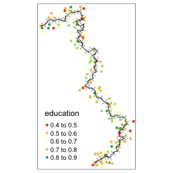<!-- -->

for plotting just a results table, it would be preferrable to choose just a `data.frame` as output (spatial.object = F). 

```r
results <- SpatialRD(y = "education", data = points_samp.sf, cutoff.points = borderpoints.sf, treated = "treated", minobs = 10, spatial.object = F)
#> We have 1000 observations of which 215 are treated observations.
#> We are iterating over 50 Boundarypoints.
#> The dependent variable is education .
knitr::kable(results) #%>% kable_styling(latex_options = "scale_down") # this last bit is new, never tried, prob not working but there must be a Markdown option
```


 Point   Estimate   pvalC   pvalR   Ntr   Nco     bw   CI_Conv_l   CI_Conv_u   CI_Rob_l   CI_Rob_u   McCrary  RATest 
------  ---------  ------  ------  ----  ----  -----  ----------  ----------  ---------  ---------  --------  -------
     1       0.12    0.02    0.05    53    55   14.2        0.02        0.21       0.00       0.24      0.51  NA     
     2       0.14    0.04    0.07    71    57   15.2        0.00        0.27      -0.01       0.30      0.41  NA     
     3       0.11    0.02    0.06   103    84   19.9        0.02        0.21       0.00       0.24      0.95  NA     
     4       0.08    0.11    0.22   100    65   16.0       -0.02        0.17      -0.05       0.20      0.60  NA     
     5       0.08    0.11    0.22   104    73   17.3       -0.02        0.17      -0.04       0.19      0.53  NA     
     6       0.07    0.09    0.22   112    84   20.9       -0.01        0.15      -0.04       0.16      0.00  NA     
     7       0.06    0.08    0.20   108    62   18.9       -0.01        0.13      -0.03       0.13       NaN  NA     
     8       0.07    0.10    0.18    93    46   17.1       -0.01        0.15      -0.03       0.16       NaN  NA     
     9       0.11    0.09    0.11    77    33   14.1       -0.02        0.24      -0.03       0.27       NaN  NA     
    10       0.13    0.04    0.05    69    32   12.3        0.01        0.26       0.00       0.30      0.03  NA     
    11       0.18    0.01    0.02    56    32   11.1        0.04        0.32       0.03       0.35      0.38  NA     
    12       0.25    0.03    0.03    40    22    9.6        0.02        0.48       0.02       0.53       NaN  NA     
    13       0.32    0.02    0.02    29    17    8.2        0.04        0.60       0.05       0.65       NaN  NA     
    14       0.20    0.01    0.01    33    32    9.5        0.06        0.35       0.06       0.40      0.86  NA     
    15       0.15    0.01    0.01    24    30    8.8        0.03        0.27       0.04       0.32       NaN  NA     
    16       0.16    0.00    0.00    52    86   13.7        0.06        0.25       0.06       0.28       NaN  NA     
    17       0.18    0.00    0.00    30    45   10.7        0.07        0.29       0.07       0.33       NaN  NA     
    18       0.15    0.01    0.02    56    98   14.5        0.04        0.26       0.02       0.29       NaN  NA     
    19       0.11    0.02    0.09    96   102   16.4        0.01        0.20      -0.01       0.21       NaN  NA     
    20       0.10    0.08    0.16    85    56   13.9       -0.01        0.21      -0.04       0.23       NaN  NA     
    21       0.08    0.11    0.22    80    39   13.2       -0.02        0.19      -0.05       0.20       NaN  NA     
    22       0.07    0.21    0.35    73    53   13.3       -0.04        0.19      -0.07       0.20       NaN  NA     
    23       0.10    0.04    0.12    96    52   14.1        0.00        0.20      -0.02       0.21       NaN  NA     
    24       0.10    0.05    0.14   103    60   14.5        0.00        0.21      -0.03       0.23       NaN  NA     
    25       0.10    0.10    0.23    83    57   13.6       -0.02        0.22      -0.06       0.24       NaN  NA     
    26       0.06    0.43    0.64    55    49   11.7       -0.09        0.20      -0.13       0.22       NaN  NA     
    27       0.05    0.56    0.80    37    38    9.6       -0.11        0.21      -0.17       0.22       NaN  NA     
    30       0.01    0.88    0.95    32    34    9.2       -0.17        0.19      -0.22       0.21       NaN  NA     
    31       0.08    0.20    0.35    65    61   12.8       -0.04        0.19      -0.08       0.21       NaN  NA     
    32       0.11    0.07    0.14    47    39   10.6       -0.01        0.22      -0.03       0.24       NaN  NA     
    33       0.10    0.01    0.04   102    68   14.9        0.02        0.17       0.00       0.20      0.75  NA     
    34       0.10    0.01    0.02   109    63   14.8        0.03        0.18       0.02       0.20      0.34  NA     
    35       0.11    0.01    0.02    53    47   11.3        0.02        0.19       0.02       0.22      0.56  NA     
    36       0.17    0.00    0.00    24    25    8.6        0.11        0.23       0.12       0.25       NaN  NA     
    37       0.15    0.00    0.01    38    21    8.6        0.05        0.26       0.05       0.29       NaN  NA     
    38       0.15    0.01    0.02   108    44   13.4        0.04        0.25       0.02       0.29       NaN  NA     
    39       0.13    0.01    0.02   167    64   16.5        0.03        0.22       0.03       0.26       NaN  NA     
    40       0.14    0.01    0.01   137    62   15.1        0.04        0.24       0.04       0.28       NaN  NA     
    41       0.18    0.00    0.00    61    45   11.1        0.06        0.30       0.07       0.34       NaN  NA     
    42       0.15    0.01    0.01    57    50   10.9        0.03        0.26       0.04       0.30       NaN  NA     
    43       0.13    0.01    0.01   163    67   16.1        0.04        0.22       0.04       0.25       NaN  NA     
    44       0.11    0.04    0.05    99    60   13.3        0.01        0.22       0.00       0.26       NaN  NA     
    45       0.10    0.04    0.05   111    59   13.8        0.01        0.20       0.00       0.23       NaN  NA     
    46       0.11    0.09    0.10   112    52   13.4       -0.02        0.23      -0.02       0.28       NaN  NA     
    47       0.08    0.12    0.13   130    60   15.5       -0.02        0.18      -0.03       0.21       NaN  NA     
    48       0.06    0.12    0.18   233    75   23.0       -0.02        0.15      -0.03       0.18      0.64  NA     
    49       0.06    0.17    0.23   162    67   19.6       -0.03        0.15      -0.04       0.17      0.22  NA     
    50       0.05    0.24    0.35   112    60   17.6       -0.03        0.12      -0.05       0.14      0.49  NA     

For the plotting of the *GRDDseries* and a visualisation in space of each point estimate we need to have a spatial object. All this is incorporated in the `plotspatialrd()` function.


```r
results <- SpatialRD(y = "education", data = points_samp.sf, cutoff.points = borderpoints.sf, treated = "treated", minobs = 10)
#> We have 1000 observations of which 215 are treated observations.
#> We are iterating over 50 Boundarypoints.
#> The dependent variable is education .
plotspatialrd(results, map = T)
```

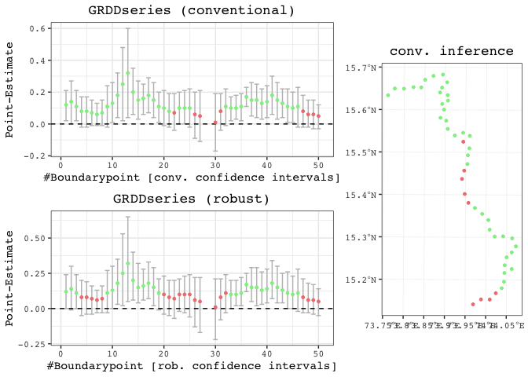<!-- -->

just the *GRDDseries*


```r
plotspatialrd(results, map = F)
```

<!-- -->


# Robustness

In Spatial Regression Discontinuity exercises, the researcher usually also has to show that the results are robust towards different specifications and parameters. Also in this respect the `SpatialRDD` package

## Placebo Borders

Here we are going to apply a standard tool that we got to know in linear algebra 1 classes: an affine transformation of the type $f(x) = x\mathbf{A}+b$, where the matrix $\mathbf{A}$ is the projection matrix to shift, (re-)scale, or rotate the border. For simplicity we now only apply a shift by 3000 metres in both directions of the border. See the next section for a complete exploration of the `placebo_border()` function and all its capabilities.


```r
placebocut_off.1 <- placebo_border(cut_off.sf, operation = "shift", shift = c(3000, 3000))
#> Pay attention to CRS! If in 4326 then degrees have to be provided. For precision we would prefer a local CRS!
placeboborderpoints.1 <- discretise_border(cutoff = placebocut_off.1, n = 50)
#> Starting to create 50 borderpoints. Approximately every 3 kilometres we can run an estimation then.
tm_shape(points_samp.sf) + tm_dots("treated", palette = "Set1")  + tm_shape(placeboborderpoints.1) + tm_symbols(shape = 4, size = .3) + tm_shape(placebocut_off.1) + tm_lines()
```

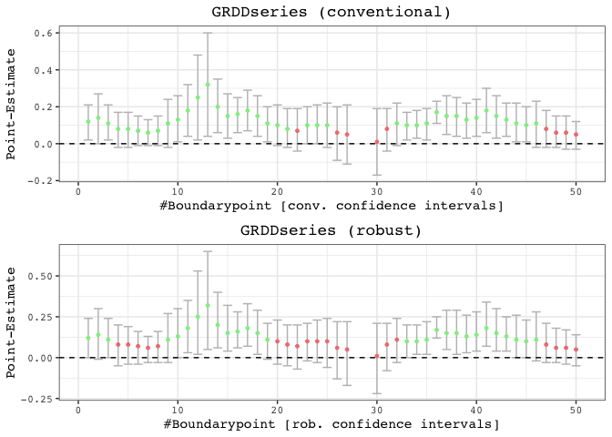<!-- -->

After the border shift we now have to re-assign the new "treated" status in order to carry out regressions. For that matter we create new polygons from scratch with the `cutoff2polygons()` function.


```r
polySideUp <- cutoff2polygons(data = points_samp.sf, cutoff = placebocut_off.1, orientation = "West-West", 
                              crs = 32643, upside = T)
polySideDown <- cutoff2polygons(data = points_samp.sf, cutoff = placebocut_off.1, orientation = "West-West",
                                crs = 32643, upside = F)

tm_shape(polySideUp) + tm_polygons(alpha = .3) + tm_shape(polySideDown) + tm_polygons(alpha = .3)
```

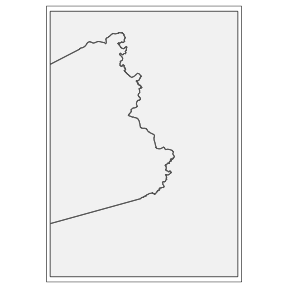<!-- -->

Finally we have to use the `assign_treated()` function from the beginning of the vignette again:


```r
points_samp.sf$treated1 <- assign_treated(data.sf = points_samp.sf, polygon.sf = polySideDown, id = "id")
sum(points_samp.sf$treated == 0 & points_samp.sf$treated1 == 1) # number of villages that switches
#> [1] 60
tm_shape(points_samp.sf) + tm_dots("treated1", palette = "Set1")  + tm_shape(placeboborderpoints.1) + tm_symbols(shape = 4, size = .3) + tm_shape(placebocut_off.1) + tm_lines()
```

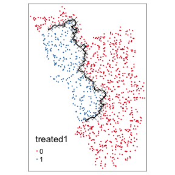<!-- -->

After plotting the points again, we can visually infer that the right villages got assign the "treated" dummy. Further we can compute the number of villages that change their status. This helps us to decide whether the bordershift was big enough (if e.g. only a handful of observations switched, then we would expect this to have little to no impact on our point estimates and thus would dub such a robustness exercise as not very meaningful).   
In this case 60 villages changed. Given the initial number of treated observations, this seems a change of a big enough magnitude and thus a meaningful robustness exercise.   

### Robustness GRD

Running the GRD 


```r
results1 <- SpatialRD(y = "education", data = points_samp.sf, cutoff.points = placeboborderpoints.1, treated = "treated1", minobs = 10)
#> We have 1000 observations of which 271 are treated observations.
#> We are iterating over 50 Boundarypoints.
#> The dependent variable is education .
plotspatialrd(results1, map = T)
```

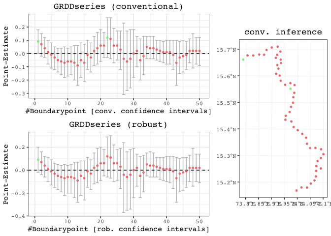<!-- -->

### Robustness Polynomial Specification

Robustness with the polynomial specification. Even this specification is insignificant


```r
points_samp.sf$segment.1.5 <- border_segment(points_samp.sf, placebocut_off.1, 5)
#> Starting to create 5 border segments with an approximate length of 26 kilometres each.
points_samp.sf$dist2cutoff1 <- as.numeric(sf::st_distance(points_samp.sf, placebocut_off.1))

summary(lm(education ~ treated1, data = points_samp.sf[points_samp.sf$dist2cutoff1 < 3000, ]))
#> 
#> Call:
#> lm(formula = education ~ treated1, data = points_samp.sf[points_samp.sf$dist2cutoff1 < 
#>     3000, ])
#> 
#> Residuals:
#>       Min        1Q    Median        3Q       Max 
#> -0.214543 -0.072272  0.003205  0.068555  0.233850 
#> 
#> Coefficients:
#>             Estimate Std. Error t value Pr(>|t|)    
#> (Intercept)  0.61669    0.01041  59.240   <2e-16 ***
#> treated11    0.02095    0.01502   1.394    0.165    
#> ---
#> Signif. codes:  0 '***' 0.001 '**' 0.01 '*' 0.05 '.' 0.1 ' ' 1
#> 
#> Residual standard error: 0.09985 on 175 degrees of freedom
#> Multiple R-squared:  0.01099,	Adjusted R-squared:  0.005335 
#> F-statistic: 1.944 on 1 and 175 DF,  p-value: 0.165
summary(felm(education ~ treated1 | factor(segment.1.5) | 0 | 0, data = points_samp.sf[points_samp.sf$dist2cutoff1 < 3000, ]), robust = T)
#> 
#> Call:
#>    felm(formula = education ~ treated1 | factor(segment.1.5) | 0 |      0, data = points_samp.sf[points_samp.sf$dist2cutoff1 < 3000,      ]) 
#> 
#> Residuals:
#>       Min        1Q    Median        3Q       Max 
#> -0.218612 -0.074442  0.004061  0.068899  0.237198 
#> 
#> Coefficients:
#>           Estimate Robust s.e t value Pr(>|t|)
#> treated11  0.01845    0.01509   1.222    0.223
#> 
#> Residual standard error: 0.09994 on 171 degrees of freedom
#> Multiple R-squared(full model): 0.03186   Adjusted R-squared: 0.003547 
#> Multiple R-squared(proj model): 0.008496   Adjusted R-squared: -0.02049 
#> F-statistic(full model, *iid*):1.125 on 5 and 171 DF, p-value: 0.3488 
#> F-statistic(proj model): 1.494 on 1 and 171 DF, p-value: 0.2233
```


## More on placebo bordering

When the border is not approximating a line in space but is curving and bending (i.e. in most cases), "placebo bordering" can be tricky and is not straightforward. The simple substraction/addition of a specified distance from the `distance2cutoff` variable is also not a very accurate description of placebo boundary. On top of that with such a simple transformation of the distance column we can at best do a placebo check on the "pooled" polynomial specification as the border segments change and thus the assignment of categories for fixed effects. A placebo GRD design with an iteration over the boundarypoints is literally impossible in such a case.   
For a proper robustness check we thus have to create a new cut-off from which we then can extract the corresponding borderpoints (with `discretise_border()`) and also assign the border segment categories for fixed effects estimations (with `border_segment()`).   
The `placebo_border()` function can execute three different (affine) transformations at the same time:

* `"shift"` in units of CRS along the x- & y-axis (provided with the option `shift = c(dist1, dist2)`)
* `"scale"` in percent around the centroid where `0.9` would mean 90%
* `"rotate"` in degrees around the centroid with the standard rotation matrix
$$
rotation =
\begin{bmatrix}
\cos \theta & -\sin \theta \\  
\sin \theta & \cos \theta \\
\end{bmatrix}
$$

### Rotate


```r

tm_rotate.sf10 <- placebo_border(border = cut_off.sf, operation = "rotate", angle = 10)
#> Pay attention to CRS! If in 4326 then degrees have to be provided. For precision we would prefer a local CRS!
tm_rotate.sf25 <- placebo_border(border = cut_off.sf, operation = "rotate", angle = 25)
#> Pay attention to CRS! If in 4326 then degrees have to be provided. For precision we would prefer a local CRS!
tm_rotate.sf45 <- placebo_border(border = cut_off.sf, operation = "rotate", angle = 45)
#> Pay attention to CRS! If in 4326 then degrees have to be provided. For precision we would prefer a local CRS!

tm_shape(polygon_full.sf) + tm_polygons() + tm_shape(cut_off.sf) + tm_lines() + 
  tm_shape(tm_rotate.sf10) + tm_lines(col = "red") + 
  tm_shape(tm_rotate.sf25) + tm_lines(col = "red") + 
  tm_shape(tm_rotate.sf45) + tm_lines(col = "red")
```

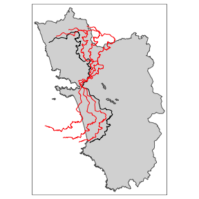<!-- -->


### Scale


```r

tm_scale.sf.4 <- placebo_border(border = cut_off.sf, operation = "scale", scale = .4)
#> Pay attention to CRS! If in 4326 then degrees have to be provided. For precision we would prefer a local CRS!
tm_scale.sf.7 <- placebo_border(border = cut_off.sf, operation = "scale", scale = .7)
#> Pay attention to CRS! If in 4326 then degrees have to be provided. For precision we would prefer a local CRS!
tm_scale.sf1.5 <- placebo_border(border = cut_off.sf, operation = "scale", scale = 1.5)
#> Pay attention to CRS! If in 4326 then degrees have to be provided. For precision we would prefer a local CRS!

tm_shape(polygon_full.sf) + tm_polygons() + tm_shape(cut_off.sf) + tm_lines() + 
  tm_shape(tm_scale.sf.4) + tm_lines(col = "blue") + 
  tm_shape(tm_scale.sf.7) + tm_lines(col = "red") + 
  tm_shape(tm_scale.sf1.5) + tm_lines(col = "red")
```

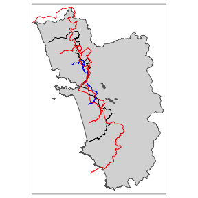<!-- -->


### Shift


```r

tm_shift.sf3 <- placebo_border(border = cut_off.sf, operation = "shift", shift = c(3000, 0))
#> Pay attention to CRS! If in 4326 then degrees have to be provided. For precision we would prefer a local CRS!
tm_shift.sf6 <- placebo_border(border = cut_off.sf, operation = "shift", shift = c(6000, 0))
#> Pay attention to CRS! If in 4326 then degrees have to be provided. For precision we would prefer a local CRS!
tm_shift.sf_4 <- placebo_border(border = cut_off.sf, operation = "shift", shift = c(-4000, 0))
#> Pay attention to CRS! If in 4326 then degrees have to be provided. For precision we would prefer a local CRS!

tm_shape(polygon_full.sf) + tm_polygons() + tm_shape(cut_off.sf) + tm_lines() + 
  tm_shape(tm_shift.sf3) + tm_lines(col = "red") + 
  tm_shape(tm_shift.sf6) + tm_lines(col = "red") + 
  tm_shape(tm_shift.sf_4) + tm_lines(col = "blue")  

tm_shift.sf_42 <- placebo_border(border = cut_off.sf, operation = "shift", shift = c(-4000, -2000))
#> Pay attention to CRS! If in 4326 then degrees have to be provided. For precision we would prefer a local CRS!
tm_shift.sf_44 <- placebo_border(border = cut_off.sf, operation = "shift", shift = c(-4000, -4000))
#> Pay attention to CRS! If in 4326 then degrees have to be provided. For precision we would prefer a local CRS!

tm_shape(polygon_full.sf) + tm_polygons() + tm_shape(cut_off.sf) + tm_lines() + 
  tm_shape(tm_shift.sf_42) + tm_lines(col = "red") + 
  tm_shape(tm_shift.sf_44) + tm_lines(col = "red") + 
  tm_shape(tm_shift.sf_4) + tm_lines(col = "blue")  
```

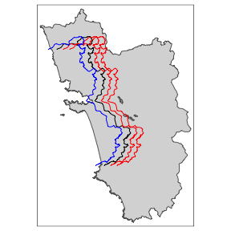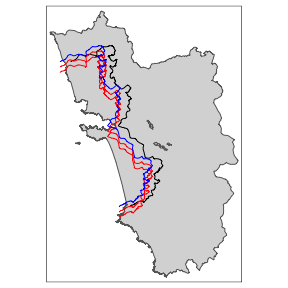

From the last shifted line we can already see that a movement along the x-axis quite often requires also a correction on the y-axis for the cut-off movement to be meaningful. This is going to be explored in detail in the following section together with all the other operations.


### Full fledged "placebo bordering"

A proper placebo border ideally involves both a shift and a re-scaling for it to be meaningful.


```r

tm_placebo.sf1 <- placebo_border(border = cut_off.sf, operation = c("shift", "scale"), shift = c(-5000, -3000), scale = .85)
#> Pay attention to CRS! If in 4326 then degrees have to be provided. For precision we would prefer a local CRS!
tm_placebo.sf2 <- placebo_border(border = cut_off.sf, operation = c("shift", "scale"), shift = c(4000, 2000), scale = 1.1)
#> Pay attention to CRS! If in 4326 then degrees have to be provided. For precision we would prefer a local CRS!
tm_placebo.sf3 <- placebo_border(border = cut_off.sf, operation = c("shift", "scale"), shift = c(6000, 3000), scale = 1.2)
#> Pay attention to CRS! If in 4326 then degrees have to be provided. For precision we would prefer a local CRS!
tm_shape(polygon_full.sf) + tm_polygons() + tm_shape(cut_off.sf) + tm_lines() + 
  tm_shape(tm_placebo.sf1) + tm_lines(col = "red") +
  tm_shape(tm_placebo.sf2) + tm_lines(col = "red") +
  tm_shape(tm_placebo.sf3) + tm_lines(col = "red")
```

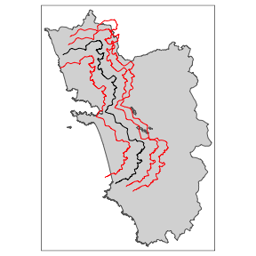<!-- -->

```r


tm_shift.sf <- placebo_border(border = cut_off.sf, operation = c("shift", "rotate", "scale"), 
                              shift = c(-10000, -1000), angle = 0, scale = .9)
#> Pay attention to CRS! If in 4326 then degrees have to be provided. For precision we would prefer a local CRS!
tm_shape(cut_off.sf) + tm_lines() + tm_shape(tm_shift.sf) + tm_lines(col = "red")
```

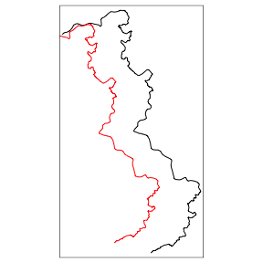<!-- -->

And the according polygons to assign the treated dummies:


```r
polygon1 <- cutoff2polygons(data = points_samp.sf, cutoff = tm_placebo.sf1, orientation = "West-West",
                                crs = 32643, upside = F)
polygon2 <- cutoff2polygons(data = points_samp.sf, cutoff = tm_placebo.sf2, orientation = "West-West",
                                crs = 32643, upside = F)
polygon3 <- cutoff2polygons(data = points_samp.sf, cutoff = tm_placebo.sf3, orientation = "West-West",
                                crs = 32643, upside = F)

tm_shape(polygon_full.sf) + tm_polygons() + 
  tm_shape(polygon_treated.sf) + tm_polygons(col = "grey") + 
  tm_shape(cut_off.sf) + tm_lines(col = "red") +
  tm_shape(polygon1) + tm_polygons(alpha = .3) +
  tm_shape(polygon2) + tm_polygons(alpha = .3) +
  tm_shape(polygon3) + tm_polygons(alpha = .3) 
```

<!-- -->

# Spatial Predictions

Another, more visual and straightforward, way to convince the audience of a potential discontinuity across space is by interpolating the variables of interest across space. This can be seen as a supplementary way for any Spatial Regression Discontinutiy design that makes the estimation on "placebo boundaries" more or less obsolete, as one can visually infer that the discontinuity is actually happening at the exact cut-off that has been put forward.   
After definining the raster template we just compute the mean of the variable of interest across the aribitrary grid-cell size that we chose:


```r
library(raster)
raster_template = raster(extent(points_samp.sf), resolution = 2000,
                         crs = st_crs(points_samp.sf)$proj4string)
raster_mean <- rasterize(points_samp.sf, raster_template, field = "education", fun = mean)
plot(rasterize(points_samp.sf, raster_template, field = "education", fun = mean), 
     axes = F)
lines(as(cut_off.sf, "Spatial")) # converting the cut-off to sp format for plotting with base-R
```

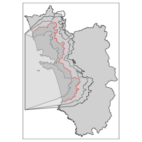<!-- -->

To also obtain values for neighbouring cells that do not contain any observations, we **manually** choose a simple weighting function, based on 3 cells around and a weight of 0.9:


```r
plot(focal(raster_mean, matrix(.9, nc = 3, nr = 3), fun = mean, NAonly = T, na.rm = T, pad = T),
     axes = F)
lines(as(cut_off.sf, "Spatial")) # converting the cut-off to sp format for plotting with base-R
```

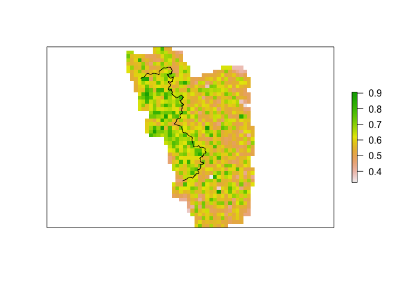<!-- -->

Here we just made use of very basic and standard spatial interpolation techniques that can be easily carried out with `raster`, a spatial workhorse package in **R**. One could think of many more sophisticated ways such as kriging.


